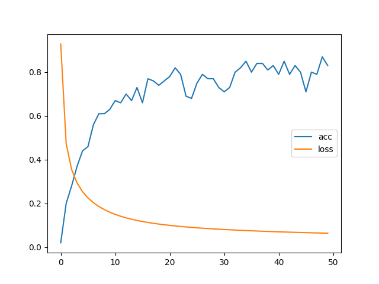

## 20251019-week02-第二周作业

### 1 作业内容和要求

[week02作业.py](week02%E4%BD%9C%E4%B8%9A.py)

#### 1.1 直播课中，宋老师给的模型脚本样例：
```
基于pytorch框架编写训练模型
实现一个自行构造的找规律（机器学习）任务
规律: x是一个多维向量(不能是一维），如果第一个数大于最后个数，则为正样本，反之为负样本
```

#### 1.2 课后作业，基于上述模型脚本，改用交叉熵实现一个多分类任务，五维随机向量最大的数字在哪维就属于哪一类
###### 基于脚本修改，我实现了如下功能
```
基于pytorch框架编写训练模型
实现一个自行构造的找规律（机器学习）任务
规律: x是一个多维向量(不能是一维），如果第一个数大于最后个数，则为正样本，反之为负样本

用交叉熵实现一个多分类任务，多维随机向量最大的数字在哪维就属于哪一类
example: x -> [1,2,3,4,5] y -> [0,0,0,0,1]
         x -> [4,3,2,1,0] y -> [1,0,0,0,0]
```

### 2 代码修改范围和注解
#### 2.1 模型输出的维度修改为与输入向量维度相同
###### 注释内容是原模型代码
```python

class TorchModel(nn.Module):
    # def __init__(self, input_size: int = 5, output_size: int = 1):
    def __init__(self, input_size: int = 5, output_size: int = 5):
        super(TorchModel, self).__init__()
        self.linear = nn.Linear(input_size, output_size)  # 线性层, 输入和输出相同维度
        # self.activation = nn.Sigmoid() 归化函数, 主要是二分类
        self.activation = nn.Softmax() # 多分类使用Softmax，输出与类别数相同维度
        # self.loss = nn.functional.mse_loss  # 损失函数采用均方差损失
        self.loss = nn.CrossEntropyLoss()  # 损失函数采用交叉熵

    # 当输入真实标签，返回loss值；无真实标签，返回预测值
    def forward(self, x, y=None):
        x = self.linear(x)  # (batch_size, input_size) -> (batch_size, output_size)
        # y_pred = self.activation(x) 
        if y is not None:
            return self.loss(x, y)  # 预测值与真实值计算损失
        else:
            # return y_pred  # 输出预测结果
            return self.activation(x, dim=1)  # 推理时输出概率
```

### 2.2 随机样本集返回的结果(y值)不一样
```python
# 生成一个样本，样本的生成方法，代表了我们要学习的规律
# 随机生成一个多维向量x，和相同维度的y，如果多维向量的x第N维是最大值，那么向量y的第N维值是1，其他是0
def build_sample(size):
    x = np.random.random(size)
    # y = 1 if x[0] > x[-1] else 0  # 二分类 仅有0和1值
    y = [ 1 if i == max(x) else 0 for i in x ] # 多分类，按输入size返回相同维度数据
    return x,y
```

### 2.3 测试代码中，y值的处理方式修改
```python
# 测试代码， 用来测试每轮模型的准确率
def evaluate(model, input_size):
    model.eval()
    test_sample_num = 100
    x, y = build_dataset(test_sample_num, input_size)
    print(f"本次预测集共有{test_sample_num}个样本")
    # print(f"本次预测集共有{sum(y)}个正样本，{test_sample_num - sum(y)}个负样本")
    correct, wrong = 0, 0
    with torch.no_grad():
        y_pred = model(x)
        for y_p, y_t in zip( y_pred, y):  # 与真实标签进行对比
            # 原有二分类判断是否预测正确
            # if float(y_p) < 0.5 and int(y_t) == 0:
            #     correct += 1  # 负样本判断正确
            # elif float(y_p) > 0.5 and int(y_t) == 1:
            #     correct += 1  # 正样本判断正确
            # else:
            #     wrong += 1
            # 现有多分类，判断预测的类别与真实类别是否一致（概率大于0.99认为是该类别）
            y_t_index = list(y_t).index(max(y_t))
            y_p_index = list(y_p).index(max(y_p))
            if y_p_index == y_t_index and (max(y_p.numpy()) - max(y_t.numpy()))**2 < 0.01:
                correct += 1  # 样本判断正确
            else:
                wrong += 1
    print(f"正确预测个数: {correct}, 错误个数: {wrong}, 正确率: {correct / test_sample_num}")
    return correct / test_sample_num
````

### 2.4 模型预测代码
###### 训练代码没有任何修改，预测代码的结果输出做了修改
```python

# 使用训练好的模型做预测
def predict(model_path, input_vec):
    input_size = 5
    model = TorchModel(input_size)
    model.load_state_dict(torch.load(model_path))  # 加载训练好的权重
    print(model.state_dict())

    model.eval()  # 测试模式
    with torch.no_grad():  # 不计算梯度
        result = model.forward(torch.FloatTensor(input_vec))  # 模型预测
    # for vec, res in zip(input_vec, result):
    # 原有二分类结果，不需要做额外处理，直接打印即可
    #     print("输入：%s, 预测类别：%d, 概率值：%f" % (vec, round(float(res)), res))  # 打印结果
    #  多分类任务结果，需要预测类别与真实类别对比进行打印
    for vec, y_p in zip(input_vec, result):
        # print(f"vec: {vec}, res: {y_p}")  # 打印结果
        y_t =  [ 1 if i == max(vec) else 0 for i in vec ]
        y_t_index = list(y_t).index(max(y_t)) + 1
        y_p_index = list(y_p).index(max(y_p)) + 1
        correct = y_p_index == y_t_index and (max(y_p.numpy()) - max(y_t)) ** 2 < 0.01
        msg = "正确" if correct else "错误"
        print(f"输入:{vec}, 预测类别:第{y_p_index}维, 实际类别:第{y_t_index}维, 预测结果{msg}, 概率值: {max(y_p.numpy())*100}")
```

### 2.5 模型脚本主函数

```
if __name__ == "__main__":
    main()
    test_vec = [[0.07889086,0.15229675,0.31082123,0.03504317,0.88920843],
                [0.74963533,0.5524256,0.95758807,0.95520434,0.84890681],
                [0.00797868,0.67482528,0.13625847,0.34675372,0.19871392],
                [0.09349776,0.59416669,0.92579291,0.41567412,0.1358894],
                [0.42735869,0.83904471,0.21465618,0.06062571,0.06084349],
                [0.30885331,0.85786346,0.54208813,0.90038646,0.72640395],
                [0.26881238,0.60675519,0.85280065,0.57306828,0.04737965],
                [0.81574041,0.54862784,0.13178178,0.79022274,0.42345878],
                [0.74287733,0.87459213,0.69047244,0.35854304,0.10841768],
                [0.41386441,0.22431992,0.09216637,0.16391365,0.03990295],
                [0.21592015,0.23645238,0.10190512,0.74825176,0.06536708]
    ]
    predict("model.bin", test_vec)
```


## 3 运行结果展示
### 3.1  执行模型脚本
```bash
python3 week02作业.py
```

### 3.2 模型脚本训练时的输出
```bash
============> 第1轮平均loss:0.9285887508392334
本次预测集共有100个样本, 正确预测个数: 2, 错误个数: 98, 正确率: 0.02
============> 第2轮平均loss:0.4734765214920044
本次预测集共有100个样本, 正确预测个数: 20, 错误个数: 80, 正确率: 0.2
============> 第3轮平均loss:0.3548176997303963
本次预测集共有100个样本, 正确预测个数: 28, 错误个数: 72, 正确率: 0.28
============> 第4轮平均loss:0.29346398931741713
本次预测集共有100个样本, 正确预测个数: 37, 错误个数: 63, 正确率: 0.37
============> 第5轮平均loss:0.2538326054215431
本次预测集共有100个样本, 正确预测个数: 44, 错误个数: 56, 正确率: 0.44
============> 第6轮平均loss:0.225312018096447
本次预测集共有100个样本, 正确预测个数: 46, 错误个数: 54, 正确率: 0.46
============> 第7轮平均loss:0.20346311169862746
本次预测集共有100个样本, 正确预测个数: 56, 错误个数: 44, 正确率: 0.56
============> 第8轮平均loss:0.18605158951878548
本次预测集共有100个样本, 正确预测个数: 61, 错误个数: 39, 正确率: 0.61
============> 第9轮平均loss:0.17180913785099983
本次预测集共有100个样本, 正确预测个数: 61, 错误个数: 39, 正确率: 0.61
============> 第10轮平均loss:0.15994842159748077
本次预测集共有100个样本, 正确预测个数: 63, 错误个数: 37, 正确率: 0.63
============> 第11轮平均loss:0.1499432446062565
本次预测集共有100个样本, 正确预测个数: 67, 错误个数: 33, 正确率: 0.67
============> 第12轮平均loss:0.14141874477267266
本次预测集共有100个样本, 正确预测个数: 66, 错误个数: 34, 正确率: 0.66
============> 第13轮平均loss:0.13409369714558125
本次预测集共有100个样本, 正确预测个数: 70, 错误个数: 30, 正确率: 0.7
============> 第14轮平均loss:0.12774940177798272
本次预测集共有100个样本, 正确预测个数: 67, 错误个数: 33, 正确率: 0.67
============> 第15轮平均loss:0.12221217143535613
本次预测集共有100个样本, 正确预测个数: 73, 错误个数: 27, 正确率: 0.73
============> 第16轮平均loss:0.11734269092977047
本次预测集共有100个样本, 正确预测个数: 66, 错误个数: 34, 正确率: 0.66
============> 第17轮平均loss:0.11302871970832348
本次预测集共有100个样本, 正确预测个数: 77, 错误个数: 23, 正确率: 0.77
============> 第18轮平均loss:0.10917968592047692
本次预测集共有100个样本, 正确预测个数: 76, 错误个数: 24, 正确率: 0.76
============> 第19轮平均loss:0.10572237479686737
本次预测集共有100个样本, 正确预测个数: 74, 错误个数: 26, 正确率: 0.74
============> 第20轮平均loss:0.10259743228554725
本次预测集共有100个样本, 正确预测个数: 76, 错误个数: 24, 正确率: 0.76
============> 第21轮平均loss:0.09975651380419731
本次预测集共有100个样本, 正确预测个数: 78, 错误个数: 22, 正确率: 0.78
============> 第22轮平均loss:0.09715999805927276
本次预测集共有100个样本, 正确预测个数: 82, 错误个数: 18, 正确率: 0.82
============> 第23轮平均loss:0.09477530285716057
本次预测集共有100个样本, 正确预测个数: 79, 错误个数: 21, 正确率: 0.79
============> 第24轮平均loss:0.09257538905739784
本次预测集共有100个样本, 正确预测个数: 69, 错误个数: 31, 正确率: 0.69
============> 第25轮平均loss:0.09053765618801117
本次预测集共有100个样本, 正确预测个数: 68, 错误个数: 32, 正确率: 0.68
============> 第26轮平均loss:0.08864313346147537
本次预测集共有100个样本, 正确预测个数: 75, 错误个数: 25, 正确率: 0.75
============> 第27轮平均loss:0.0868757516592741
本次预测集共有100个样本, 正确预测个数: 79, 错误个数: 21, 正确率: 0.79
============> 第28轮平均loss:0.08522183838486672
本次预测集共有100个样本, 正确预测个数: 77, 错误个数: 23, 正确率: 0.77
============> 第29轮平均loss:0.08366966699063778
本次预测集共有100个样本, 正确预测个数: 77, 错误个数: 23, 正确率: 0.77
============> 第30轮平均loss:0.08220912975072861
本次预测集共有100个样本, 正确预测个数: 73, 错误个数: 27, 正确率: 0.73
============> 第31轮平均loss:0.08083144952356815
本次预测集共有100个样本, 正确预测个数: 71, 错误个数: 29, 正确率: 0.71
============> 第32轮平均loss:0.07952899804711341
本次预测集共有100个样本, 正确预测个数: 73, 错误个数: 27, 正确率: 0.73
============> 第33轮平均loss:0.07829508320987225
本次预测集共有100个样本, 正确预测个数: 80, 错误个数: 20, 正确率: 0.8
============> 第34轮平均loss:0.07712379267811775
本次预测集共有100个样本, 正确预测个数: 82, 错误个数: 18, 正确率: 0.82
============> 第35轮平均loss:0.07600996279716492
本次预测集共有100个样本, 正确预测个数: 85, 错误个数: 15, 正确率: 0.85
============> 第36轮平均loss:0.07494901165366173
本次预测集共有100个样本, 正确预测个数: 80, 错误个数: 20, 正确率: 0.8
============> 第37轮平均loss:0.07393678578734397
本次预测集共有100个样本, 正确预测个数: 84, 错误个数: 16, 正确率: 0.84
============> 第38轮平均loss:0.07296958811581135
本次预测集共有100个样本, 正确预测个数: 84, 错误个数: 16, 正确率: 0.84
============> 第39轮平均loss:0.07204416100680829
本次预测集共有100个样本, 正确预测个数: 81, 错误个数: 19, 正确率: 0.81
============> 第40轮平均loss:0.07115749548375606
本次预测集共有100个样本, 正确预测个数: 83, 错误个数: 17, 正确率: 0.83
============> 第41轮平均loss:0.07030692177265882
本次预测集共有100个样本, 正确预测个数: 79, 错误个数: 21, 正确率: 0.79
============> 第42轮平均loss:0.06949003486335277
本次预测集共有100个样本, 正确预测个数: 85, 错误个数: 15, 正确率: 0.85
============> 第43轮平均loss:0.06870462618768215
本次预测集共有100个样本, 正确预测个数: 79, 错误个数: 21, 正确率: 0.79
============> 第44轮平均loss:0.06794867453724146
本次预测集共有100个样本, 正确预测个数: 83, 错误个数: 17, 正确率: 0.83
============> 第45轮平均loss:0.06722034424543381
本次预测集共有100个样本, 正确预测个数: 80, 错误个数: 20, 正确率: 0.8
============> 第46轮平均loss:0.06651799431443214
本次预测集共有100个样本, 正确预测个数: 71, 错误个数: 29, 正确率: 0.71
============> 第47轮平均loss:0.06584007488936186
本次预测集共有100个样本, 正确预测个数: 80, 错误个数: 20, 正确率: 0.8
============> 第48轮平均loss:0.06518520211428404
本次预测集共有100个样本, 正确预测个数: 79, 错误个数: 21, 正确率: 0.79
============> 第49轮平均loss:0.06455201434344053
本次预测集共有100个样本, 正确预测个数: 87, 错误个数: 13, 正确率: 0.87
============> 第50轮平均loss:0.06393933479487895
本次预测集共有100个样本, 正确预测个数: 83, 错误个数: 17, 正确率: 0.83
```

### 3.3 导入matplotlib.pyplot模块，绘制的损失值loss和准确率acc曲线



### 3.4 模型预测结果输出
```bash
输入:[0.07889086, 0.15229675, 0.31082123, 0.03504317, 0.88920843], 预测类别:第5维, 实际类别:第5维, 预测结果正确, 概率值: 100.0
输入:[0.74963533, 0.5524256, 0.95758807, 0.95520434, 0.84890681], 预测类别:第3维, 实际类别:第3维, 预测结果错误, 概率值: 53.08525562286377
输入:[0.00797868, 0.67482528, 0.13625847, 0.34675372, 0.19871392], 预测类别:第2维, 实际类别:第2维, 预测结果正确, 概率值: 100.0
输入:[0.09349776, 0.59416669, 0.92579291, 0.41567412, 0.1358894], 预测类别:第3维, 实际类别:第3维, 预测结果正确, 概率值: 100.0
输入:[0.42735869, 0.83904471, 0.21465618, 0.06062571, 0.06084349], 预测类别:第2维, 实际类别:第2维, 预测结果正确, 概率值: 100.0
输入:[0.30885331, 0.85786346, 0.54208813, 0.90038646, 0.72640395], 预测类别:第4维, 实际类别:第4维, 预测结果正确, 概率值: 94.04364228248596
输入:[0.26881238, 0.60675519, 0.85280065, 0.57306828, 0.04737965], 预测类别:第3维, 实际类别:第3维, 预测结果正确, 概率值: 99.99998807907104
输入:[0.81574041, 0.54862784, 0.13178178, 0.79022274, 0.42345878], 预测类别:第1维, 实际类别:第1维, 预测结果错误, 概率值: 82.71955847740173
输入:[0.74287733, 0.87459213, 0.69047244, 0.35854304, 0.10841768], 预测类别:第2维, 实际类别:第2维, 预测结果正确, 概率值: 99.97695088386536
输入:[0.41386441, 0.22431992, 0.09216637, 0.16391365, 0.03990295], 预测类别:第1维, 实际类别:第1维, 预测结果正确, 概率值: 99.99940395355225
输入:[0.21592015, 0.23645238, 0.10190512, 0.74825176, 0.06536708], 预测类别:第4维, 实际类别:第4维, 预测结果正确, 概率值: 100.0
```

### 备注：[NLP学习笔记-Week02](https://share.note.youdao.com/s/Pe5Yv9Ip)