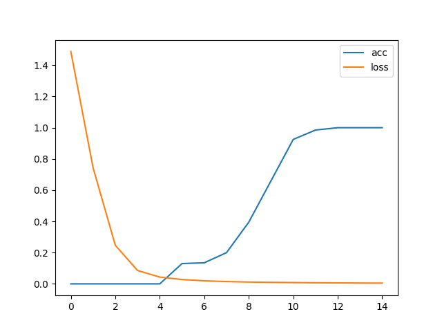

## 20251026-week03-第三周作业

### 1 作业内容和要求

[week03作业.py](week03%E4%BD%9C%E4%B8%9A.py)

#### 1.1 直播课中，宋老师给的模型脚本样例：
```
基于pytorch的网络编写
实现一个网络完成一个简单nlp任务
判断文本中是否有某些特定字符出现，如果有则为正样本，反之为负样本
```

#### 1.2 课后作业，基于上述模型脚本，改用rnn来判断关键字出现的位置
###### 基于脚本修改，我实现了如下功能
```
基于pytorch框架编写训练模型
实现一个自行构造的找规律（机器学习）任务
规律: 通过rnn模型来训练，配合交叉熵，预测关键字出现的位置
```

### 2 代码修改范围和注解
#### 2.1 模型初始化改用rnn和交叉熵、forward中取rnn输出的末尾值
###### 注释内容是原模型代码
```python

class TorchModel(nn.Module):
    def __init__(self, vector_dim, sentence_length, vocab):
        super(TorchModel, self).__init__()
        self.embedding = nn.Embedding(len(vocab), vector_dim, padding_idx=0)  #embedding层
        # self.pool = nn.AvgPool1d(sentence_length)   #池化层
        # self.classify = nn.Linear(vector_dim, 1)     #线性层
        self.activation = nn.functional.softmax     # softmax归一化函数
        self.rnn = nn.RNN(vector_dim, vector_dim, bias=False, batch_first=True)
        # self.loss = nn.functional.mse_loss  #loss函数采用均方差损失，交叉熵中已包含
        self.classify = nn.Linear(vector_dim, sentence_length)     #
        self.loss = nn.functional.cross_entropy  #交叉熵

    #当输入真实标签，返回loss值；无真实标签，返回预测值
    def forward(self, x, y=None):
        x = self.embedding(x)                      #(batch_size, sen_len) -> (batch_size, sen_len, vector_dim)
        """
        通过rnn模型，这些操作都不需要 
        x = x.transpose(1, 2)                      #(batch_size, sen_len, vector_dim) -> (batch_size, vector_dim, sen_len)
        x = self.pool(x)                           #(batch_size, vector_dim, sen_len)->(batch_size, vector_dim, 1)
        x = x.squeeze()                            #(batch_size, vector_dim, 1) -> (batch_size, vector_dim)
        x = self.classify(x)                       #(batch_size, vector_dim) -> (batch_size, 1) 3*20 20*1 -> 3*1
        y_pred =  self.activation(x)               #(batch_size, 1) -> (batch_size, 1)
        """
        rnn_out, hidden = self.rnn(x)
        x = rnn_out[:, -1, :]
        y_pred = self.classify(x)
        if y is not None:
            return self.loss(y_pred, y)      #预测值和真实值计算损失
        else:
            return self.activation(y_pred)   #softmax输出预测结果
```

### 2.2 随机样本集返回的结果(y值)不一样
```python
# 生成一个样本，样本的生成方法，代表了我们要学习的规律
# 随机生成一个多维向量x，和相同维度的y，如果多维向量的x第N维是最大值，那么向量y的第N维值是1，其他是0
def build_sample(size):
    """
     #随机从字表选取sentence_length个字，可能重复
    x = [random.choice(list(vocab.keys())) for _ in range(sentence_length)]
    #指定哪些字出现时为正样本
    if set("你我他") & set(x):
        y = 1
    #指定字都未出现，则为负样本
    else:
        y = 0
    x = [vocab.get(word, vocab['unk']) for word in x]   #将字转换成序号，为了做embedding
    return x, y
    """
    # 随机从字表选取sentence_length个字，可能重复,
    # 避免关键字重复或者不存在，把关键字单独拿出来与其他字符一起组合成样本，再随机打乱顺序
    keyword = "天"
    keyword_index = vocab[keyword]
    keyword_list = [ k for k in vocab if k != keyword ]
    words = [random.choice(keyword_list) for _ in range(sentence_length-1)] + [keyword]
    random.shuffle(words)  #打乱顺序
    x = [vocab.get(word, vocab['unk']) for word in words]   #将字转换成序号，为了做embedding
    y = [ 1 if keyword_index == i else 0 for i in x ]   # 样本维度根据关键字出现的索引来判断
    # print(f"build_sample words: {words}, x: {x}, y: {y}")
    return x, y
```

### 2.3 测试代码中，y值的处理方式修改
```python
#用来测试每轮模型的准确率
def evaluate(model, vocab, sample_length):
    model.eval()
    test_sample_num = 200
    x, y = build_dataset(test_sample_num, vocab, sample_length)   #建立200个用于测试的样本
    print(f"本次预测集共有{test_sample_num}个样本")
    # print("本次预测集中共有%d个正样本，%d个负样本"%(sum(y), 200 - sum(y)))
    correct, wrong = 0, 0
    with torch.no_grad():
        y_pred = model(x)      #模型预测
        """ 原有判断正负样本的代码
        for y_p, y_t in zip(y_pred, y):  #与真实标签进行对比
            if float(y_p) < 0.5 and int(y_t) == 0:
                correct += 1   #负样本判断正确
            elif float(y_p) >= 0.5 and int(y_t) == 1:
                correct += 1   #正样本判断正确
            else:
                wrong += 1
        """
        for x, y_p, y_t in zip(x, y_pred, y):  #与真实标签进行对比
            print(f"x: {x}, y_p: {y_p}, y_t: {y_t}")
            y_t_index = list(y_t).index(max(y_t))
            y_p_index = list(y_p).index(max(y_p))
            if y_p_index == y_t_index and (max(y_p.numpy()) - max(y_t.numpy()))**2 < 0.0001:
                correct += 1  # 样本判断正确
            else:
                wrong += 1
    print(f"正确预测个数: {correct}, 错误个数: {wrong}, 正确率: {correct / test_sample_num}")
    return correct/(correct+wrong)
````

### 2.4 模型预测代码
###### 训练代码没有任何修改，预测代码的结果输出做了修改
```python
def predict(model_path, vocab_path, input_strings):
    char_dim = 20  # 每个字的维度
    sentence_length = 6  # 样本文本长度
    vocab = json.load(open(vocab_path, "r", encoding="utf8")) #加载字符表
    model = TorchModel(char_dim, sentence_length, vocab)    #建立模型
    model.load_state_dict(torch.load(model_path))             #加载训练好的权重
    x = []
    keyword = "天"
    keyword_index = vocab[keyword]
    for input_string in input_strings:
        x.append([vocab.get(char, vocab['unk']) for char in input_string])  #将输入序列化
    model.eval()   #测试模式
    with torch.no_grad():  #不计算梯度
        result = model.forward(torch.LongTensor(x))  #模型预测
    for words, vec, y_p in zip(input_strings, x, result):
        y_t =  [ 1 if i == keyword_index else 0 for i in vec ]
        y_t_index = list(y_t).index(max(y_t)) + 1
        y_p_index = list(y_p).index(max(y_p)) + 1
        correct = y_p_index == y_t_index and (max(y_p.numpy()) - max(y_t)) ** 2 < 0.001
        msg = "正确" if correct else "错误"
        print(f"输入:{words}, 正确结果: {y_t}, 预测概率: {y_p} 预测类别:第{y_p_index}维, 实际类别:第{y_t_index}维, 预测结果{msg}, 概率值: {max(y_p.numpy())*100}")
        # print(f"输入：{input_string}, 预测类别：{round(float(result[i]))}, 概率值：{result[i]}") #打印结果
```

### 2.5 模型脚本主函数

```
if __name__ == "__main__":
    main()
    test_strings = ["fnvf天e", "wz你df天", "rq天deg", "n我k天ww"]
    predict("model.pth", "vocab.json", test_strings)
```


## 3 运行结果展示
### 3.1  执行模型脚本
```bash
python3 week03作业.py
```

### 3.2 模型脚本训练时的输出
```bash=========第1轮平均loss:1.4882942008972169%
本次预测集共有200个样本
/Users/felix/PycharmProjects/test-1/week3 深度学习处理文本/NLPDemoStudy.py:51: UserWarning: Implicit dimension choice for softmax has been deprecated. Change the call to include dim=X as an argument.
  return self.activation(y_pred)   #输出预测结果
正确预测个数: 0, 错误个数: 200, 正确率: 0.0
=========第2轮平均loss:0.7437910318374634%
本次预测集共有200个样本
正确预测个数: 0, 错误个数: 200, 正确率: 0.0
=========第3轮平均loss:0.2470879489183426%
本次预测集共有200个样本
正确预测个数: 0, 错误个数: 200, 正确率: 0.0
=========第4轮平均loss:0.08560361459851265%
本次预测集共有200个样本
正确预测个数: 0, 错误个数: 200, 正确率: 0.0
=========第5轮平均loss:0.043558465838432314%
本次预测集共有200个样本
正确预测个数: 0, 错误个数: 200, 正确率: 0.0
=========第6轮平均loss:0.027815455868840218%
本次预测集共有200个样本
正确预测个数: 26, 错误个数: 174, 正确率: 0.13
=========第7轮平均loss:0.01964578565210104%
本次预测集共有200个样本
正确预测个数: 27, 错误个数: 173, 正确率: 0.135
=========第8轮平均loss:0.014734378829598428%
本次预测集共有200个样本
正确预测个数: 40, 错误个数: 160, 正确率: 0.2
=========第9轮平均loss:0.011576759032905101%
本次预测集共有200个样本
正确预测个数: 79, 错误个数: 121, 正确率: 0.395
=========第10轮平均loss:0.00975013829767704%
本次预测集共有200个样本
正确预测个数: 132, 错误个数: 68, 正确率: 0.66
=========第11轮平均loss:0.008229513317346573%
本次预测集共有200个样本
正确预测个数: 185, 错误个数: 15, 正确率: 0.925
=========第12轮平均loss:0.00673713929951191%
本次预测集共有200个样本
正确预测个数: 197, 错误个数: 3, 正确率: 0.985
=========第13轮平均loss:0.006067377962172032%
本次预测集共有200个样本
正确预测个数: 200, 错误个数: 0, 正确率: 1.0
=========第14轮平均loss:0.0053188584931194785%
本次预测集共有200个样本
正确预测个数: 200, 错误个数: 0, 正确率: 1.0
=========第15轮平均loss:0.00480114795267582%
本次预测集共有200个样本
正确预测个数: 200, 错误个数: 0, 正确率: 1.0
```

### 3.3 导入matplotlib.pyplot模块，绘制的损失值loss和准确率acc曲线



### 3.4 模型预测结果输出
```bash
输入:fnvf天e, 正确结果: [0, 0, 0, 0, 1, 0], 预测概率: tensor([4.9444e-04, 9.2148e-06, 3.7234e-04, 7.3868e-04, 9.9761e-01, 7.7821e-04]) 预测类别:第5维, 实际类别:第5维, 预测结果正确, 概率值: 99.76071119308472
输入:wz你df天, 正确结果: [0, 0, 0, 0, 0, 1], 预测概率: tensor([7.5663e-04, 7.2296e-04, 8.4427e-05, 6.8963e-04, 9.0254e-04, 9.9684e-01]) 预测类别:第6维, 实际类别:第6维, 预测结果正确, 概率值: 99.68438148498535
输入:rq天deg, 正确结果: [0, 0, 1, 0, 0, 0], 预测概率: tensor([1.4839e-04, 2.2412e-03, 9.9480e-01, 1.9539e-03, 8.3065e-04, 2.7749e-05]) 预测类别:第3维, 实际类别:第3维, 预测结果正确, 概率值: 99.47980642318726
输入:n我k天ww, 正确结果: [0, 0, 0, 1, 0, 0], 预测概率: tensor([4.0424e-05, 3.7476e-04, 2.5644e-03, 9.9507e-01, 1.0180e-03, 9.3387e-04]) 预测类别:第4维, 实际类别:第4维, 预测结果正确, 概率值: 99.50685501098633
```

### 备注：[NLP学习笔记-Week03](https://share.note.youdao.com/s/bWznz9ep)